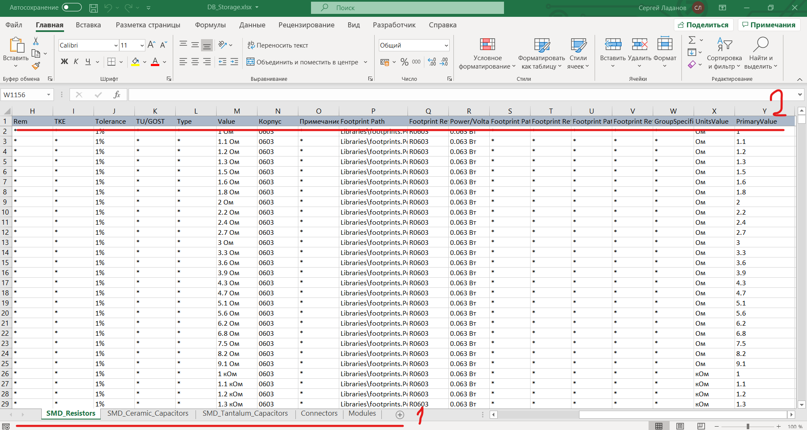
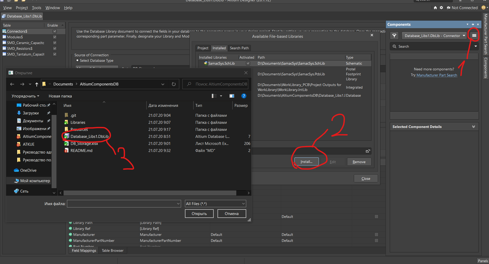

# AltiumComponentsDB

Библиотека компонентов Altium Designer в виде базы данных

## Описание файлов

### Общая структура файлов

1. Libraries\Elements.SchLib - Библиотека УГО;
2. Libraries\footprints.PcbLib - Библиотека посадочных мест;
3. Database_Libs1.DbLib - Основной файл библиотеки;
4. DB_Storage.xlsx - Файл с информацией о связи УГО и посадочных мест.

### Организация базы данных
Информация о компонентах содержится в файле DB_Storage.xlsx:

Цифрой 1 отмечены таблицы с компонентами, цифрой 2 - наименования параметров компонентов.

#### Базовые параметры таблицы DB_Storage.xlsx
* Library Ref - Наименование УГО в библиотеке .SchLib;
* Library Path - Путь до библиотеки УГО .SchLib;
* Footprint Path - Путь до библиотеки посадочных мест .PcbLib;
* Footprint Ref - Наименование посадочного места компонента в библиотеке .PcbLib

## Подключение библиотеки

Цифрами отмечен порядок действий